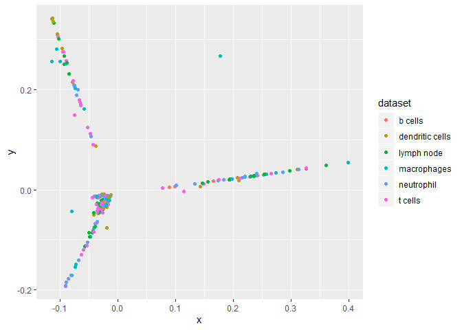
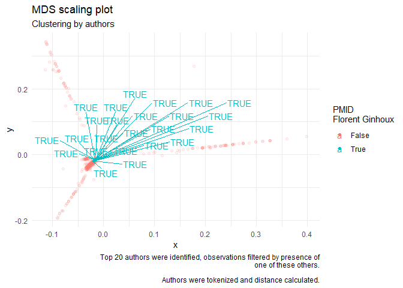

Further Exploration of the data
================
Arpan Neupane
26/06/2020

\#\#load libraries

``` {r}(ggplot2)
library(tidyverse)
library
```

## Cluster by authors.

Would it be possible to cluster research articles by authors? There must
be \>100K authors in the dataset. Let’s limit to top-20
authors

``` r
#reading data in from previous filtering step (look at file titled generating initial plots)
path <- paste(getwd(),"datafiles/prelim_data",sep = "/")
path <- path %>% gsub("rmd/","",.)
my_data <- readRDS(file = path)
t_20 <- my_data %>% unnest(authorlist) %>% na.omit %>% filter(authorlist != "NA NA") %>% group_by(authorlist,dataset) %>% 
  summarize(total_pub = n()) %>% arrange(desc(total_pub)) %>% head(20) %>% select(authorlist) %>% pull;t_20
```

    ##  [1] "Darragh Duffy"      "Wei Wang"           "Florent Ginhoux"   
    ##  [4] "Wei Wang"           "Guido Kroemer"      "Wei Li"            
    ##  [7] "Wei Zhang"          "Alberto Briganti"   "Xin Li"            
    ## [10] "Yi Zhang"           "Li Zhang"           "Shahrokh F Shariat"
    ## [13] "Wei Chen"           "Yang Liu"           "David Sancho"      
    ## [16] "Jing Wang"          "Jing Wang"          "Li Chen"           
    ## [19] "Tanja D de Gruijl"  "Vincent Bondet"

``` r
#note that the t_20 is also based on dataset grouping. 
```

Now that we have a list of top 20 authors. We will filter the dataset to
rows only if they contain some of these authors, and get the PMIDs of
the filtered
data

``` r
t_20_pmid <- my_data %>% unnest(authorlist) %>% na.omit %>% filter(authorlist!= "NA NA") %>% filter(authorlist %in% t_20) %>% select(PMID) %>% unique %>% pull
length(t_20_pmid)
```

    ## [1] 492

``` r
my_data %>% filter(PMID %in% t_20_pmid) %>% select(abstract) %>% unique %>% pull %>% length
```

    ## [1] 379

``` r
#some of these data have missing abstract. Either way; lets get them out.

my_df_small <- my_data %>% filter(PMID %in% t_20_pmid) %>% select(PMID, authorlist, country) %>% unnest(authorlist)

#how many unique authors?
my_df_small %>% select(authorlist) %>% unique %>% pull %>% length
```

    ## [1] 4643

The small dataset, initially filtered by top 20 authors, now has 4643
(including all sub authors etc)

Will now count occurrences of each author, by PMID, and look at
correlation between different PMIDs. Note that we have \~492 unique
PMIDs

First, lets look through who is already working together. For this case,
I will pull out authorlists for people working with Darragh Duffy and
Florent
Ginhoux

``` r
florent_authors <- my_data %>% rowwise %>% mutate(authorlist = unlist(authorlist) %>% paste(collapse=",")) %>% mutate(to_keep = grepl("Florent Ginhoux",authorlist)) %>% 
  filter(to_keep) %>% select(authorlist) %>% pull %>% paste(collapse = ",") %>% str_split(pattern = ",") %>% unlist %>% unique;length(florent_authors)
```

    ## [1] 713

``` r
florent_pmid <- my_data %>% rowwise %>% mutate(authorlist = unlist(authorlist) %>% paste(collapse=",")) %>% mutate(to_keep = grepl("Florent Ginhoux",authorlist)) %>% 
  filter(to_keep) %>% select(PMID) %>% pull 

length(florent_pmid)
```

    ## [1] 24

There are 713 unique authors that florent ginhoux has “collaborated”
with in 24 unique PMIDs

Can we find a similar structure, but graphically? Remember to filter
top\_20 pmid

``` r
#library(tidytext)

my_data_tokens <- my_data %>% filter(PMID %in% t_20_pmid) %>% na.omit %>% 
  rowwise() %>% mutate(authorlist = unlist(authorlist) %>% paste(collapse=",") %>% gsub(" ","",x = .) %>% gsub("-","",x=.)) %>% 
  unnest_tokens(authors,authorlist) %>% group_by(PMID,authors) %>% summarize(counts = n())
```

    ## Warning: Grouping rowwise data frame strips rowwise nature

``` r
my_data_tokens <- my_data_tokens %>% arrange(desc(counts)) %>% mutate(counts = ifelse(counts>=2,1,counts))#noticed the PMID had authors name repeated for some reason.

my_data_tokens_spread <- my_data_tokens %>% spread(key=authors, value = counts) %>% replace(is.na(.),0)

my_data_tokens_matrix <- as.matrix(my_data_tokens_spread[,c(2:(ncol(my_data_tokens_spread)-1))])
rownames(my_data_tokens_matrix) <- my_data_tokens_spread$PMID
#view small bit
my_data_tokens_matrix[1:2,1:2]
```

    ##          aaronbossler aaronjmarshall
    ## 30694364            0              0
    ## 30709742            0              0

Now that we have created a matrix. Can we find correlation between
authors? Alternatively, can we find correlation between PMID ? Not sure
if this is correct way of doing this.

``` r
dist_pmid <- dist(my_data_tokens_matrix,method = "binary")
mds <- cmdscale(d = dist_pmid,eig = F,k = 2)
#check if rownames PMID were kept
rownames(mds) %>% head
```

    ## [1] "30694364" "30709742" "30738087" "30772194" "30774630" "30778250"

``` r
#combine to a tibble and plot

tibble(x=mds[,1],y=mds[,2],PMID = rownames(mds)) %>% left_join(my_data,by="PMID") %>% 
  ggplot(aes(x = x, y = y, fill = dataset))+
  geom_point(aes(color = dataset))
```

<!-- -->

``` r
# make intermediate dataframe; of only top_20_pmids 
# also include search terms
search_terms <- c("b cells|b-cells|b cell|b-cell","t-cells|t cells|t cell|t-cell","dendritic|dc|dcs|dendritic cells","macrophages|macrophage",
                  "neutrophil|neutrophils","lymph node|LN|lymph nodes")

top_20_inter <- my_data %>% filter(PMID %in% t_20_pmid) %>% na.omit %>% 
  rowwise() %>% mutate(authorlist = unlist(authorlist) %>% paste(collapse=",")) %>% 
  mutate(articletitle = gsub("'","",x = articletitle)) %>% mutate(combine_both = paste0(abstract,articletitle)) %>% mutate(title_contains= case_when(
  grepl(search_terms[1],combine_both,ignore.case = T)~"B Cell related",
  grepl(search_terms[2],combine_both, ignore.case = T)~"T Cell related",
  grepl(search_terms[3],combine_both, ignore.case = T)~"Dendritic Cell related",
  grepl(search_terms[4],combine_both, ignore.case = T)~"Macrophage related",
  grepl(search_terms[5],combine_both, ignore.case = T)~"Neutrophil related",
  grepl(search_terms[6],combine_both, ignore.case = T)~"Lymph Node related")
  ) %>% select(-combine_both) %>% mutate(florent_true = ifelse(PMID %in% florent_pmid,TRUE,FALSE))
glimpse(top_20_inter)
```

    ## Observations: 492
    ## Variables: 10
    ## $ PMID           <chr> "32554932", "32546725", "32502047", "32481780",...
    ## $ articletitle   <chr> "Single cell rna sequencing identifies an early...
    ## $ abstract       <chr> "The acute respiratory distress syndrome (ARDS)...
    ## $ authorlist     <chr> "Yale Jiang,Brian R Rosborough,Jie Chen,Sudipta...
    ## $ journal        <chr> "JCI insight", "Leukemia", "Medicine", "Rhode I...
    ## $ publishedon    <date> 2020-06-20, 2020-06-18, 2020-06-06, 2020-06-03...
    ## $ country        <chr> "United States", "England", "United States", "U...
    ## $ dataset        <chr> "neutrophil", "neutrophil", "neutrophil", "neut...
    ## $ title_contains <chr> "Neutrophil related", NA, "Neutrophil related",...
    ## $ florent_true   <lgl> FALSE, FALSE, FALSE, FALSE, FALSE, FALSE, FALSE...

``` r
# label florent ginhoux papers
library(ggrepel)
plot_mds <- 
  tibble(x=mds[,1],y=mds[,2],PMID = rownames(mds)) %>% left_join(top_20_inter,by="PMID") %>% 
  ggplot(aes(x = x, y = y, color = as.factor(florent_true), alpha = florent_true))+
  geom_point()+
  geom_text_repel(aes(label = ifelse(florent_true,as.character(florent_true),"")))+
  theme_minimal()+
  scale_color_discrete(aesthetics = c("color"), name = "PMID\nFlorent Ginhoux",labels = c("False","True"),)+
  scale_alpha_discrete(guide=F)+
  labs(title = "MDS scaling plot",subtitle = "Clustering by authors",caption = "Top 20 authors were identified, observations filtered by presence of\none of these others.\n
       Authors were tokenized and distance calculated.")
```

    ## Warning: Using alpha for a discrete variable is not advised.

``` r
plot_mds
```

<!-- -->

``` r
path <- gsub("prelim_data","cluster_by_author.pdf",path)
ggsave(path,plot = plot_mds, device = "pdf",dpi = 300)
```

    ## Saving 7 x 5 in image

The plot shows that it is possilbe to find colloborators (by direcy
inclusion of names in author list) or by closeness. This may be not be
the best approach of clustering by authors. However, I think it is a
step in the right direction.
