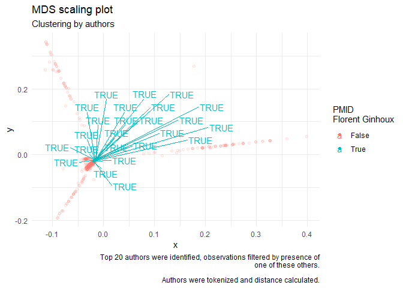

Further Exploration of the data
================
Arpan Neupane
26/06/2020

\#\#load libraries

``` r
library(ggplot2)
library(tidyverse)
library(tidytext)
library(ggiraph)
```

## Cluster by authors.

Would it be possible to cluster research articles by authors? There must
be \>100K authors in the dataset. Let’s limit to top-20
authors

``` r
#reading data in from previous filtering step (look at file titled generating initial plots)
path <- paste(getwd(),"datafiles/prelim_data",sep = "/")
path <- path %>% gsub("rmd/","",.)
my_data <- readRDS(file = path)
t_20 <- my_data %>% unnest(authorlist) %>% na.omit %>% filter(authorlist != "NA NA") %>% group_by(authorlist,dataset) %>% 
  summarize(total_pub = n()) %>% arrange(desc(total_pub)) %>% head(20) %>% select(authorlist) %>% pull;t_20
```

    ## `summarise()` regrouping output by 'authorlist' (override with `.groups` argument)

    ##  [1] "Darragh Duffy"      "Wei Wang"           "Florent Ginhoux"   
    ##  [4] "Wei Wang"           "Guido Kroemer"      "Wei Li"            
    ##  [7] "Wei Zhang"          "Alberto Briganti"   "Xin Li"            
    ## [10] "Yi Zhang"           "Li Zhang"           "Shahrokh F Shariat"
    ## [13] "Wei Chen"           "Yang Liu"           "David Sancho"      
    ## [16] "Jing Wang"          "Jing Wang"          "Li Chen"           
    ## [19] "Tanja D de Gruijl"  "Vincent Bondet"

``` r
#note that the t_20 is also based on dataset grouping. 
```

Now that we have a list of top 20 authors. We will filter the dataset to
rows only if they contain some of these authors, and get the PMIDs of
the filtered
data

``` r
t_20_pmid <- my_data %>% unnest(authorlist) %>% na.omit %>% filter(authorlist!= "NA NA") %>% filter(authorlist %in% t_20) %>% select(PMID) %>% unique %>% pull
length(t_20_pmid)
```

    ## [1] 492

``` r
my_data %>% filter(PMID %in% t_20_pmid) %>% select(abstract) %>% unique %>% pull %>% length
```

    ## [1] 379

``` r
#some of these data have missing abstract. Either way; lets get them out.

my_df_small <- my_data %>% filter(PMID %in% t_20_pmid) %>% select(PMID, authorlist, country) %>% unnest(authorlist)

#how many unique authors?
my_df_small %>% select(authorlist) %>% unique %>% pull %>% length
```

    ## [1] 4643

The small dataset, initially filtered by top 20 authors, now has 4643
(including all sub authors etc)

Will now count occurrences of each author, by PMID, and look at
correlation between different PMIDs. Note that we have \~492 unique
PMIDs

First, lets look through who is already working together. For this case,
I will pull out authorlists for people working with Darragh Duffy and
Florent
Ginhoux

``` r
florent_authors <- my_data %>% rowwise %>% mutate(authorlist = unlist(authorlist) %>% paste(collapse=",")) %>% mutate(to_keep = grepl("Florent Ginhoux",authorlist)) %>% 
  filter(to_keep) %>% select(authorlist) %>% pull %>% paste(collapse = ",") %>% str_split(pattern = ",") %>% unlist %>% unique;length(florent_authors)
```

    ## [1] 713

``` r
florent_pmid <- my_data %>% rowwise %>% mutate(authorlist = unlist(authorlist) %>% paste(collapse=",")) %>% mutate(to_keep = grepl("Florent Ginhoux",authorlist)) %>% 
  filter(to_keep) %>% select(PMID) %>% pull 

length(florent_pmid)
```

    ## [1] 24

There are 713 unique authors that florent ginhoux has “collaborated”
with in 24 unique PMIDs

Can we find a similar structure, but graphically? Remember to filter
top\_20 pmid

``` r
#library(tidytext)

my_data_tokens <- my_data %>% filter(PMID %in% t_20_pmid) %>% na.omit %>% 
  rowwise() %>% mutate(authorlist = unlist(authorlist) %>% paste(collapse=",") %>% gsub(" ","",x = .) %>% gsub("-","",x=.)) %>% 
  unnest_tokens(authors,authorlist) %>% group_by(PMID,authors) %>% summarize(counts = n())
```

    ## `summarise()` regrouping output by 'PMID' (override with `.groups` argument)

``` r
my_data_tokens <- my_data_tokens %>% arrange(desc(counts)) %>% mutate(counts = ifelse(counts>=2,1,counts))#noticed the PMID had authors name repeated for some reason.

my_data_tokens_spread <- my_data_tokens %>% spread(key=authors, value = counts) %>% replace(is.na(.),0)

my_data_tokens_matrix <- as.matrix(my_data_tokens_spread[,c(2:(ncol(my_data_tokens_spread)-1))])
rownames(my_data_tokens_matrix) <- my_data_tokens_spread$PMID
#view small bit
my_data_tokens_matrix[1:2,1:2]
```

    ##          aaronbossler aaronjmarshall
    ## 30694364            0              0
    ## 30709742            0              0

Now that we have created a matrix. Can we find correlation between
authors? Alternatively, can we find correlation between PMID ? Not sure
if this is correct way of doing this.

``` r
dist_pmid <- dist(my_data_tokens_matrix,method = "binary")
mds <- cmdscale(d = dist_pmid,eig = F,k = 2)
#check if rownames PMID were kept
rownames(mds) %>% head
```

    ## [1] "30694364" "30709742" "30738087" "30772194" "30774630" "30778250"

``` r
#combine to a tibble and plot

tibble(x=mds[,1],y=mds[,2],PMID = rownames(mds)) %>% left_join(my_data,by="PMID") %>% 
  ggplot(aes(x = x, y = y, fill = dataset))+
  geom_point(aes(color = dataset))
```

<!-- -->

``` r
# make intermediate dataframe; of only top_20_pmids 
# also include search terms
search_terms <- c("b cells|b-cells|b cell|b-cell","t-cells|t cells|t cell|t-cell","dendritic|dc|dcs|dendritic cells","macrophages|macrophage",
                  "neutrophil|neutrophils","lymph node|LN|lymph nodes")

top_20_inter <- my_data %>% filter(PMID %in% t_20_pmid) %>% na.omit %>% 
  rowwise() %>% mutate(authorlist = unlist(authorlist) %>% paste(collapse=",")) %>% 
  mutate(articletitle = gsub("'","",x = articletitle)) %>% mutate(combine_both = paste0(abstract,articletitle)) %>% mutate(title_contains= case_when(
  grepl(search_terms[1],combine_both,ignore.case = T)~"B Cell related",
  grepl(search_terms[2],combine_both, ignore.case = T)~"T Cell related",
  grepl(search_terms[3],combine_both, ignore.case = T)~"Dendritic Cell related",
  grepl(search_terms[4],combine_both, ignore.case = T)~"Macrophage related",
  grepl(search_terms[5],combine_both, ignore.case = T)~"Neutrophil related",
  grepl(search_terms[6],combine_both, ignore.case = T)~"Lymph Node related")
  ) %>% select(-combine_both) %>% mutate(florent_true = ifelse(PMID %in% florent_pmid,TRUE,FALSE))
glimpse(top_20_inter)
```

    ## Rows: 492
    ## Columns: 10
    ## Rowwise: 
    ## $ PMID           <chr> "32554932", "32546725", "32502047", "32481780", "324...
    ## $ articletitle   <chr> "Single cell rna sequencing identifies an early mono...
    ## $ abstract       <chr> "The acute respiratory distress syndrome (ARDS) resu...
    ## $ authorlist     <chr> "Yale Jiang,Brian R Rosborough,Jie Chen,Sudipta Das,...
    ## $ journal        <chr> "JCI insight", "Leukemia", "Medicine", "Rhode Island...
    ## $ publishedon    <date> 2020-06-20, 2020-06-18, 2020-06-06, 2020-06-03, 202...
    ## $ country        <chr> "United States", "England", "United States", "United...
    ## $ dataset        <chr> "neutrophil", "neutrophil", "neutrophil", "neutrophi...
    ## $ title_contains <chr> "Neutrophil related", NA, "Neutrophil related", "Neu...
    ## $ florent_true   <lgl> FALSE, FALSE, FALSE, FALSE, FALSE, FALSE, FALSE, FAL...

``` r
# label florent ginhoux papers
library(ggrepel)
```

    ## Warning: package 'ggrepel' was built under R version 3.6.3

``` r
plot_mds <- 
  tibble(x=mds[,1],y=mds[,2],PMID = rownames(mds)) %>% left_join(top_20_inter,by="PMID") %>% 
  ggplot(aes(x = x, y = y, color = as.factor(florent_true), alpha = florent_true))+
  geom_point()+
  geom_text_repel(aes(label = ifelse(florent_true,as.character(florent_true),"")))+
  theme_minimal()+
  scale_color_discrete(aesthetics = c("color"), name = "PMID\nFlorent Ginhoux",labels = c("False","True"),)+
  scale_alpha_discrete(guide=F)+
  labs(title = "MDS scaling plot",subtitle = "Clustering by authors",caption = "Top 20 authors were identified, observations filtered by presence of\none of these others.\n
       Authors were tokenized and distance calculated.")
```

    ## Warning: Using alpha for a discrete variable is not advised.

``` r
plot_mds
```

<!-- -->

``` r
path <- gsub("prelim_data","cluster_by_author.pdf",path)
ggsave(path,plot = plot_mds, device = "pdf",dpi = 300)
```

    ## Saving 7 x 5 in image

The plot shows that it is possilbe to find colloborators (by direct
inclusion of names in author list) or by closeness. This may be not be
the best approach of clustering by authors. However, I think it is a
step in the right direction.

\#Can we further improve this? What if we treated each document as a
results from single cell RNAseq experiment. I do not have expertise in
this. However, since we are counting “features” per document and looking
across all our documents, I thought why not?

The following was taken from Satijalab.org tutorial on singlecell
clustering with Seurat

``` r
#remove PMID with no abstract
my_data <- my_data %>% filter(abstract != "")

#combine title, author, abstract into a single feature
my_data_concat <- my_data %>% filter(country!="China") %>% rowwise() %>% mutate(authorlist = unlist(authorlist) %>% paste(collapse=",") %>% gsub(" ","",x=.)) %>% filter(authorlist != "NANA") %>% 
mutate(combined = paste(articletitle,abstract,authorlist,sep=","))

#remove puncuations
my_data_concat <- my_data_concat %>% rowwise %>% mutate(combined = gsub("-|'|:|=|<|>|(|)","",x=combined))

glimpse(my_data_concat)
```

    ## Rows: 19,246
    ## Columns: 9
    ## Rowwise: 
    ## $ PMID         <chr> "32564279", "32564202", "32564160", "32564084", "32564...
    ## $ articletitle <chr> "Urine neutrophil gelatinase-associated lipocalin in g...
    ## $ abstract     <chr> "BACKGROUND: Children who experience more than one uri...
    ## $ authorlist   <chr> "CatherineSForster,AllisonMLoechtenfeldt,SamirSShah,St...
    ## $ journal      <chr> "Pediatric nephrology (Berlin, Germany)", "Apoptosis :...
    ## $ publishedon  <date> 2020-06-22, 2020-06-22, 2020-06-22, 2020-06-22, 2020-...
    ## $ country      <chr> "Germany", "Netherlands", "Germany", "England", "Engla...
    ## $ dataset      <chr> "neutrophil", "neutrophil", "neutrophil", "neutrophil"...
    ## $ combined     <chr> "Urine neutrophil gelatinaseassociated lipocalin in gi...

``` r
my_data_start <- my_data_concat %>% select(PMID,combined)

#make sure tidytext is loaded
library(tidytext)
#tokenize words
my_data_start_all <- my_data_start %>% group_by(PMID) %>% unnest_tokens(output = word,combined,to_lower = T) #%>% 

#adding some immunology related words to stop_words
tb_word <- tibble(word = c(stop_words$word,"conclusion","conclusions","result","results","background","methods",
                           "method","material","materials","keyword","keywords","main","hypothesis","immune","cells","cell","immunology","immunity",
                           "mean","se","sd","cv","ci","pvalue","p","0.05","0.01","0.95","95","control","tx","con","nature","confidenceinterval",
                           "confidence","interval","significant","0.001","objective","0.001","inflammation","findings","controls","suggest","suggests","levels","level","level","difference","significance","abstracttext","analysis","analyze","treated"))

#remove stop_words
my_data_start_all <- my_data_start_all %>%ungroup %>% anti_join(tb_word,by = "word")

#did this to generate tf, idf, and tf_idf for all
my_data_start_all <- my_data_start_all %>% group_by(PMID,word) %>% summarize(count = n()) %>% ungroup %>% bind_tf_idf(word,PMID,count)
```

    ## `summarise()` regrouping output by 'PMID' (override with `.groups` argument)

``` r
#cast as a sparse matrix
my_data_tfidf <- cast_sparse(my_data_start_all,row = PMID,column = word,value = count)
my_data_tfidf_t <- Matrix::t(my_data_tfidf)
rm(my_data_tfidf)
#write some metadeta
meta_data <- my_data_concat %>% 
  select(-c(abstract,publishedon,journal,country,combined)) %>% rowwise %>% mutate(articletitle = gsub("'","",x = articletitle)) %>% 
  as.data.frame
rownames(meta_data) <- meta_data$PMID
meta_data <- meta_data %>% select(-PMID)
meta_data %>% head
```

    ##                                                                                                                                                           articletitle
    ## 32564279                                                            Urine neutrophil gelatinase-associated lipocalin in girls with recurrent urinary tract infections.
    ## 32564202               The pro-apoptotic ARTS protein induces neutrophil apoptosis, efferocytosis, and macrophage reprogramming to promote resolution of inflammation.
    ## 32564160       Demographic and clinical characteristics of patients with ANCA-positive vasculitis in a Colombian University Hospital over a 12-year period: 2005-2017.
    ## 32564084                                Prognostic value of lymphocyte-to-C-reactive protein ratio in patients with gastric cancer after surgery: a multicentre study.
    ## 32564055 Allogeneic hematopoietic stem cell transplantation from a 2-HLA-haplotype-mismatched family donor for posttransplant relapse: a prospective phase I/II study.
    ## 32563928                             Assessment of peripheral blood neutrophil respiratory burst, phagocytosis and apoptosis in obese non-insulin dysregulated horses.
    ##                                                                                                                                                                                                                                                   authorlist
    ## 32564279                                                                                                                                                                                  CatherineSForster,AllisonMLoechtenfeldt,SamirSShah,StuartGoldstein
    ## 32564202                                                                                                                                                 NaamaMaimon,ZoharZviZamir,PrajaktaKalkar,OrlyZeytuni-Timor,SagieSchif-Zuck,SaritLarisch,AmiramAriel
    ## 32564160                                                                                                                      DanielGFernández-Ávila,JuliánRondón-Carvajal,CatalinaVillota-Eraso,JuanMartínGutiérrez-Dávila,KateirMarielContreras-Villamizar
    ## 32564084                                                                                                                                                                                               Chuan-BingCheng,Qu-XiaZhang,Lv-PingZhuang,Jian-WeiSun
    ## 32564055 KazuhiroIkegame,KatsujiKaida,KeikoFukunaga,YukoOsugi,KyokoYoshihara,SatoshiYoshihara,ShinichiIshii,SatoshiFujino,TakayaYamashita,AzusaMayumi,SatoshiMaruyama,MasahiroTeramoto,TakayukiInoue,MasayaOkada,HiroyaTamaki,HiroyasuOgawa,YosihiroFujimori
    ## 32563928                                                                                                                                         ConstanzaSalinas,GabrielEspinosa,NataliaMorales,ClaudioHenríquez,GabrielMorán,GonzaloGajardo,BenjaminUberti
    ##             dataset
    ## 32564279 neutrophil
    ## 32564202 neutrophil
    ## 32564160 neutrophil
    ## 32564084 neutrophil
    ## 32564055 neutrophil
    ## 32563928 neutrophil

``` r
if(!"Seurat" %in% installed.packages()){
  install.packages("Seurat")
}else(library(Seurat))
```

    ## Warning: package 'Seurat' was built under R version 3.6.3

    ##  [1] "Seurat"    "ggrepel"   "ggiraph"   "tidytext"  "forcats"   "stringr"  
    ##  [7] "dplyr"     "purrr"     "readr"     "tidyr"     "tibble"    "ggplot2"  
    ## [13] "tidyverse" "stats"     "graphics"  "grDevices" "utils"     "datasets" 
    ## [19] "methods"   "base"

``` r
#i think the min cells is to select only cells with at least 10 features 
#min.features is to keep features that are present in atleast 5 cells
doc_seurat <- CreateSeuratObject(counts = my_data_tfidf_t, meta.data = meta_data,min.cells = 5,min.features = 10)
doc_seurat
```

    ## An object of class Seurat 
    ## 21996 features across 19245 samples within 1 assay 
    ## Active assay: RNA (21996 features, 0 variable features)

``` r
#features were reduced to ~20K

#"Normalizing". Need to read more about what this is doing
doc_seurat <- NormalizeData(doc_seurat, normalization.method = "LogNormalize", scale.factor = 10000)

#I think this is findining the features that have the highest variation
doc_seurat <- FindVariableFeatures(doc_seurat)
doc_seurat
```

    ## An object of class Seurat 
    ## 21996 features across 19245 samples within 1 assay 
    ## Active assay: RNA (21996 features, 2000 variable features)

``` r
#suggesting that 2000 features are interesting (highly variable), other are "similar"?
doc_seurat <- ScaleData(doc_seurat)
```

    ## Centering and scaling data matrix

``` r
#this does PCA with highly variable features or all features? not sure. 
doc_seurat <- RunPCA(doc_seurat, npcs = 100, ndims.print = 1:10, nfeatures.print = 5)
```

    ## PC_ 1 
    ## Positive:  de, la, en, el, del 
    ## Negative:  dcs, cd4, treg, dc, th17 
    ## PC_ 2 
    ## Positive:  de, injury, la, kidney, treg 
    ## Negative:  os, recurrence, hr, breast, nlr 
    ## PC_ 3 
    ## Positive:  pd1, cd4, cd8, pdl1, dcs 
    ## Negative:  kidney, injury, renal, urinary, ngal 
    ## PC_ 4 
    ## Positive:  asthma, allergic, airway, intestinal, gut 
    ## Negative:  pd1, pdl1, cd8, cd4, kidney 
    ## PC_ 5 
    ## Positive:  healing, wound, axillary, breast, brain 
    ## Negative:  nlr, plr, os, asthma, allergic 
    ## PC_ 6 
    ## Positive:  intestinal, gut, colitis, microbiota, colon 
    ## Negative:  asthma, allergic, airway, ige, breast 
    ## PC_ 7 
    ## Positive:  nlr, plr, brain, crp, microglia 
    ## Negative:  allergic, asthma, kidney, airway, ct 
    ## PC_ 8 
    ## Positive:  breast, axillary, her2, women, mastectomy 
    ## Negative:  gastric, gastrectomy, laparoscopic, ct, gc 
    ## PC_ 9 
    ## Positive:  healing, wound, pd1, pdl1, m2 
    ## Negative:  covid19, sarscov2, igg, women, axillary 
    ## PC_ 10 
    ## Positive:  dcs, dc, kidney, renal, bone 
    ## Negative:  covid19, sarscov2, cd4, cd8, obesity

``` r
#i think the above code will only generate eigen vectors for the first npcs principle component (?)
#is much faster that running prcomp or princomp
#setting npcs higher makes it run longer

#show sd by PCs?
ElbowPlot(doc_seurat, ndims = 100)
```

<!-- -->

``` r
#most variation in the initial pcs then start tapering off (slowly)

#the tutorial used 75 pcs, following that
#most other parameters are left alone. need to read what they are and what they do
doc_seurat <- FindNeighbors(doc_seurat, reduction = "pca", dims = 1:75, nn.eps = 0.5)
```

    ## Computing nearest neighbor graph

    ## Computing SNN

``` r
doc_seurat <- FindClusters(doc_seurat, resolution = 3, n.start = 10)#took ~3-5 minutes
```

    ## Modularity Optimizer version 1.3.0 by Ludo Waltman and Nees Jan van Eck
    ## 
    ## Number of nodes: 19245
    ## Number of edges: 1062668
    ## 
    ## Running Louvain algorithm...
    ## Maximum modularity in 10 random starts: 0.5230
    ## Number of communities: 747
    ## Elapsed time: 3 seconds

    ## 651 singletons identified. 96 final clusters.

``` r
#dimension reduction
doc_seurat <- RunUMAP(doc_seurat, dims = 1:75, min.dist = 0.75,)
```

    ## Warning: The default method for RunUMAP has changed from calling Python UMAP via reticulate to the R-native UWOT using the cosine metric
    ## To use Python UMAP via reticulate, set umap.method to 'umap-learn' and metric to 'correlation'
    ## This message will be shown once per session

    ## 02:02:46 UMAP embedding parameters a = 0.2734 b = 1.622

    ## 02:02:46 Read 19245 rows and found 75 numeric columns

    ## 02:02:46 Using Annoy for neighbor search, n_neighbors = 30

    ## 02:02:46 Building Annoy index with metric = cosine, n_trees = 50

    ## 0%   10   20   30   40   50   60   70   80   90   100%

    ## [----|----|----|----|----|----|----|----|----|----|

    ## **************************************************|
    ## 02:02:52 Writing NN index file to temp file C:\Users\arpns\AppData\Local\Temp\RtmpslRpXG\file208036f57499
    ## 02:02:52 Searching Annoy index using 1 thread, search_k = 3000
    ## 02:03:03 Annoy recall = 87.88%
    ## 02:03:03 Commencing smooth kNN distance calibration using 1 thread
    ## 02:03:04 761 smooth knn distance failures
    ## 02:03:05 Initializing from normalized Laplacian + noise
    ## 02:03:06 Commencing optimization for 200 epochs, with 863536 positive edges
    ## 02:03:34 Optimization finished

``` r
#visualize
d1 <- DimPlot(doc_seurat, reduction = "umap", pt.size = 0.1,group.by = "dataset") + ggtitle(label = "UMAP\ncolored by initial search query")
d2 <- DimPlot(doc_seurat, reduction = "umap", pt.size = 0.1,label = T)+ggtitle(label = "UMAP\ncolored by clusters assiged by Seurat")
```

    ## Warning: Using `as.character()` on a quosure is deprecated as of rlang 0.3.0.
    ## Please use `as_label()` or `as_name()` instead.
    ## This warning is displayed once per session.

``` r
d1
```

<!-- -->

``` r
d2+theme(legend.position ="none")
```

<!-- -->

Ok so this looks like an interesting approach. First, the graphs look
nicer\! there are actual “clusters” compared to just doing pca.

HoverLocator (also from
Seurat)

``` r
#HoverLocator(plot = d1, information =FetchData(doc_seurat,vars = "articletitle"))
```

What if we want to search for specific terms?

``` r
plot_what <- function(whattolookfor){
  #what to look for can be a single string or a vector of characters
  #remove space, not that not all search terms will yeild results
  FeaturePlot(doc_seurat,features = whattolookfor, reduction = "umap",pt.size = 0.1)
}

#this shows some issues that need to be dealt with.
plot_what(c("neutrophil"))
```

<!-- -->

Issues still exist. For example: neutrophil vs neutrophils might not
results in same documents being identified. See
below:

``` r
plot_what(c("neutrophils","neutrophil"))
```

<!-- -->
However, we did get some clustering going based on features.

I also tried to use the FindMarkers function to identify what terms were
driving clustering.

``` r
#see d2 for cluster labels
d2+theme(legend.position = "none")
```

<!-- -->

``` r
FindMarkers(doc_seurat, ident.1 = 32)
```

    ##                         p_val  avg_logFC pct.1 pct.2     p_val_adj
    ## axillary         0.000000e+00  4.9923214 0.889 0.003  0.000000e+00
    ## alnd             0.000000e+00  4.0369784 0.213 0.000  0.000000e+00
    ## mastectomy       0.000000e+00  3.7532739 0.319 0.001  0.000000e+00
    ## slnb             0.000000e+00  3.4432673 0.213 0.002  0.000000e+00
    ## breast           0.000000e+00  3.3864771 0.928 0.034  0.000000e+00
    ## sentinel         0.000000e+00  3.2183014 0.478 0.011  0.000000e+00
    ## axilla           0.000000e+00  3.1606775 0.188 0.001  0.000000e+00
    ## biopsy          1.385828e-237  2.5615054 0.464 0.032 3.048267e-233
    ## dissection      1.749724e-232  2.2730280 0.464 0.032 3.848693e-228
    ## node            4.952012e-207  2.0821835 0.870 0.140 1.089245e-202
    ## lymph           2.265292e-187  1.8784127 0.976 0.197 4.982735e-183
    ## sln             3.100926e-141  2.4571935 0.126 0.003 6.820797e-137
    ## neoadjuvant     6.120010e-135  2.3253277 0.222 0.013 1.346157e-130
    ## ultrasound      4.902768e-102  2.5852043 0.155 0.008  1.078413e-97
    ## nodal           8.034029e-102  2.2441809 0.213 0.015  1.767165e-97
    ## surgery          4.790211e-97  1.9021598 0.430 0.064  1.053655e-92
    ## nodes            7.398362e-87  1.9010038 0.483 0.089  1.627344e-82
    ## cancer           7.513899e-74  1.1885425 0.797 0.256  1.652757e-69
    ## ductal           2.204735e-70  1.9791561 0.130 0.008  4.849536e-66
    ## underwent        3.512767e-57  1.6694708 0.343 0.065  7.726682e-53
    ## chemotherapy     1.888793e-50  1.5269094 0.290 0.052  4.154589e-46
    ## invasive         8.746253e-49  1.8769959 0.188 0.025  1.923826e-44
    ## woman            5.204322e-43  1.9955316 0.126 0.013  1.144743e-38
    ## negative         2.701796e-40  1.6345519 0.271 0.056  5.942871e-36
    ## radiation        5.311170e-38  1.8763959 0.135 0.016  1.168245e-33
    ## metastatic       1.156099e-37  1.5144541 0.242 0.047  2.542955e-33
    ## positive         1.174791e-32  1.5555225 0.309 0.082  2.584071e-28
    ## postoperative    4.307704e-29  1.5408163 0.174 0.032  9.475225e-25
    ## patients         2.846983e-28  0.7832228 0.758 0.416  6.262223e-24
    ## technique        1.203043e-26  1.8201181 0.111 0.016  2.646214e-22
    ## preoperative     1.459689e-24  1.4672944 0.140 0.025  3.210732e-20
    ## management       8.088589e-24  1.5062337 0.169 0.036  1.779166e-19
    ## women            1.942595e-23  1.6635257 0.130 0.023  4.272933e-19
    ## surgical         2.573117e-22  1.2118761 0.193 0.047  5.659829e-18
    ## status           4.042795e-22  1.1933436 0.208 0.053  8.892531e-18
    ## metastases       1.858266e-21  1.2572840 0.164 0.037  4.087442e-17
    ## imaging          2.139883e-21  1.4411517 0.179 0.043  4.706886e-17
    ## 2018             4.294566e-21  1.2506804 0.135 0.027  9.446328e-17
    ## undergoing       3.520227e-20  1.5809630 0.126 0.024  7.743092e-16
    ## left             8.190813e-20  1.7708006 0.101 0.017  1.801651e-15
    ## standard         4.642524e-19  1.2792631 0.145 0.032  1.021170e-14
    ## staging          2.281549e-18  1.2053691 0.106 0.019  5.018495e-14
    ## patient          1.259677e-17  0.9724620 0.285 0.102  2.770786e-13
    ## included         1.988577e-17  1.0435425 0.246 0.081  4.374074e-13
    ## metastasis       7.237437e-17  1.1219921 0.256 0.089  1.591947e-12
    ## female           9.494757e-17  1.1867394 0.121 0.026  2.088467e-12
    ## adjuvant         9.639411e-17  1.0911395 0.140 0.033  2.120285e-12
    ## clinically       3.586005e-16  1.2970266 0.130 0.031  7.887777e-12
    ## expression       8.707220e-15 -2.0930461 0.043 0.288  1.915240e-10
    ## diagnosed        8.907299e-15  1.0088082 0.174 0.052  1.959249e-10
    ## carcinoma        2.863298e-14  1.0250329 0.222 0.078  6.298110e-10
    ## january          3.055434e-14  1.1962721 0.106 0.024  6.720733e-10
    ## months           3.891344e-14  0.9853811 0.203 0.068  8.559400e-10
    ## trial            4.904894e-14  1.2815976 0.106 0.024  1.078881e-09
    ## rare             1.544149e-13  1.1506224 0.155 0.046  3.396510e-09
    ## performed        2.897784e-13  0.8838008 0.304 0.130  6.373965e-09
    ## complete         4.237001e-13  1.1169768 0.140 0.040  9.319708e-09
    ## retrospective    4.525057e-13  0.9672715 0.155 0.046  9.953316e-09
    ## mass             9.536509e-13  1.2685669 0.121 0.032  2.097651e-08
    ## recurrence       2.633047e-12  0.9266919 0.140 0.041  5.791651e-08
    ## pathology        5.438018e-12  1.1452554 0.111 0.029  1.196146e-07
    ## followup         1.479979e-11  1.0540500 0.140 0.043  3.255362e-07
    ## macrophages      1.988444e-11 -2.9675233 0.014 0.201  4.373782e-07
    ## rates            2.110772e-10  0.9414958 0.135 0.043  4.642855e-06
    ## sensitivity      2.287621e-10  1.1929962 0.106 0.030  5.031851e-06
    ## rate             2.933525e-10  1.1497636 0.193 0.077  6.452582e-06
    ## received         2.971982e-10  1.1834779 0.135 0.044  6.537171e-06
    ## activation       3.795633e-10 -2.6753586 0.010 0.176  8.348875e-06
    ## responses        3.890370e-10 -3.2910466 0.000 0.161  8.557258e-06
    ## mice             6.642525e-10 -2.7534948 0.005 0.166  1.461090e-05
    ## age              1.385768e-09  0.6676577 0.188 0.074  3.048136e-05
    ## protein          7.852169e-09 -2.0968227 0.014 0.164  1.727163e-04
    ## role             8.154560e-09 -1.1784568 0.077 0.255  1.793677e-04
    ## identification   1.802114e-08  1.0791844 0.101 0.032  3.963929e-04
    ## range            2.616558e-08  0.8390691 0.111 0.036  5.755381e-04
    ## dendritic        3.159915e-08 -1.5943361 0.019 0.163  6.950550e-04
    ## effects          3.861381e-08 -1.6919372 0.024 0.167  8.493493e-04
    ## report           3.971199e-08  0.9157380 0.174 0.074  8.735050e-04
    ## local            4.119810e-08  0.7767328 0.126 0.045  9.061934e-04
    ## activity         4.956781e-08 -2.9634496 0.000 0.126  1.090293e-03
    ## considered       5.945132e-08  0.9274594 0.145 0.056  1.307691e-03
    ## median           6.961900e-08  0.6133500 0.140 0.053  1.531339e-03
    ## inflammatory     1.787388e-07 -1.2092404 0.039 0.181  3.931540e-03
    ## retrospectively  1.863953e-07  0.8214778 0.101 0.034  4.099950e-03
    ## development      2.778053e-07 -1.8897021 0.034 0.163  6.110604e-03
    ## production       2.879546e-07 -2.8425689 0.000 0.113  6.333850e-03
    ## induced          2.985954e-07 -1.8808931 0.010 0.130  6.567904e-03
    ## diagnosis        2.989206e-07  0.6946355 0.179 0.080  6.575057e-03
    ## therapy          3.180619e-07  0.5333555 0.271 0.141  6.996089e-03
    ## size             4.210849e-07  0.7796628 0.126 0.048  9.262184e-03
    ## characteristics  4.880235e-07  0.7167703 0.145 0.060  1.073457e-02
    ## total            5.736834e-07  0.6160670 0.213 0.102  1.261874e-02
    ## human            9.363309e-07 -1.8275769 0.043 0.167  2.059553e-02
    ## features         1.872545e-06  0.8956286 0.150 0.067  4.118849e-02
    ## pathological     1.998329e-06  0.6655481 0.130 0.054  4.395524e-02
    ## signaling        2.143874e-06 -2.4868080 0.005 0.107  4.715665e-02
    ## vitro            2.933020e-06 -2.1582697 0.005 0.105  6.451471e-02
    ## function         3.155904e-06 -1.0897409 0.029 0.144  6.941727e-02
    ## gene             3.312853e-06 -2.2032056 0.010 0.112  7.286951e-02
    ## diagnostic       3.662131e-06  1.0619644 0.101 0.039  8.055223e-02
    ## neutrophil       3.738373e-06 -2.5122285 0.005 0.102  8.222926e-02
    ## mechanisms       6.389471e-06 -1.7020262 0.024 0.129  1.405428e-01
    ## increased        8.433384e-06 -0.8551084 0.097 0.225  1.855007e-01
    ## regression       1.287879e-05  0.6220937 0.111 0.046  2.832819e-01
    ## stage            1.387692e-05  0.6296223 0.159 0.077  3.052368e-01
    ## risk             1.769202e-05  0.7986815 0.188 0.099  3.891538e-01
    ## lt               1.847854e-05  0.3429200 0.208 0.109  4.064539e-01
    ## purpose          1.861722e-05  0.5376654 0.116 0.049  4.095044e-01
    ## blood            2.022858e-05 -1.1649767 0.048 0.156  4.449478e-01
    ## diseases         2.369673e-05 -1.6824230 0.014 0.105  5.212333e-01
    ## therapeutic      7.397936e-05 -1.0298705 0.053 0.154  1.000000e+00
    ## potential        9.283639e-05 -0.9259446 0.082 0.185  1.000000e+00
    ## effect           2.550134e-04 -0.9390101 0.053 0.140  1.000000e+00
    ## infection        2.965942e-04 -1.0080482 0.034 0.115  1.000000e+00
    ## determine        3.775780e-04  0.4186022 0.130 0.066  1.000000e+00
    ## model            3.891339e-04 -0.7271097 0.063 0.153  1.000000e+00
    ## 3                4.154757e-04  0.5060012 0.198 0.116  1.000000e+00
    ## investigated     4.224741e-04 -1.1511305 0.029 0.103  1.000000e+00
    ## response         4.581047e-04 -0.7695833 0.130 0.228  1.000000e+00
    ## evaluate         1.067779e-03  0.4047984 0.140 0.078  1.000000e+00
    ## review           1.068919e-03  0.4414162 0.203 0.125  1.000000e+00
    ## reduced          1.393548e-03 -0.5758181 0.043 0.115  1.000000e+00
    ## decreased        1.618601e-03 -0.8250857 0.039 0.107  1.000000e+00
    ## primary          1.781016e-03  0.5733020 0.184 0.115  1.000000e+00
    ## 10               3.404489e-03  0.4533763 0.111 0.062  1.000000e+00
    ## 2                3.902843e-03  0.3241175 0.227 0.150  1.000000e+00
    ## identified       4.819850e-03  0.3560563 0.188 0.120  1.000000e+00
    ## tissue           5.241048e-03 -0.5402104 0.058 0.123  1.000000e+00
    ## factor           5.464716e-03 -0.7986802 0.077 0.141  1.000000e+00
    ## aim              5.674230e-03  0.4133090 0.130 0.078  1.000000e+00
    ## current          8.013724e-03  0.3526662 0.126 0.074  1.000000e+00
    ## including        9.430053e-03 -0.5652825 0.116 0.183  1.000000e+00
    ## tumors           1.396126e-02  0.2890311 0.126 0.078  1.000000e+00
    ## system           2.416852e-02 -0.4106915 0.077 0.129  1.000000e+00
    ## factors          2.596046e-02  0.3866313 0.179 0.128  1.000000e+00
    ## receptor         3.346170e-02 -0.6036752 0.087 0.136  1.000000e+00
    ## addition         4.222833e-02 -0.5966757 0.063 0.104  1.000000e+00
    ## studies          2.536336e-01 -0.3237566 0.145 0.170  1.000000e+00
    ## revealed         3.059461e-01  0.3002619 0.140 0.119  1.000000e+00
    ## survival         4.071820e-01 -0.2651917 0.145 0.165  1.000000e+00
    ## significantly    4.325314e-01 -0.2958509 0.208 0.219  1.000000e+00

``` r
#this cluster apparently contains information on nets (netrophil extracellular traps)
```

Now if only I could figure out how to label clusters according to the
terms that were higher in them\! next time.
