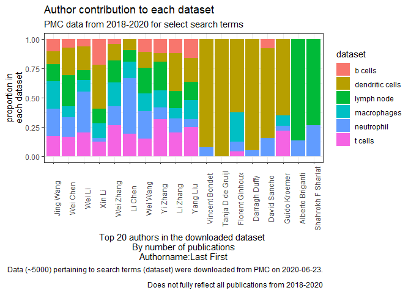
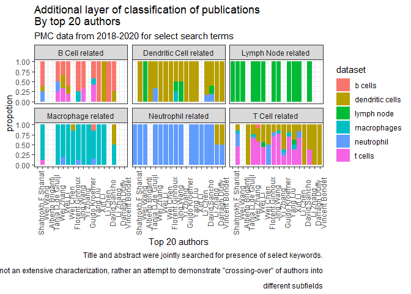

generating initial plots
================
Arpan Neupane
24/06/2020

## Purpose

To demonstrate the issue my project is attempting to address. dataframe
has been saved as
    rdata

``` r
library(tidyverse)
```

    ## -- Attaching packages --------------------------------------------------------- tidyverse 1.2.1 --

    ## v ggplot2 3.2.1     v purrr   0.3.2
    ## v tibble  2.1.3     v dplyr   0.8.3
    ## v tidyr   0.8.3     v stringr 1.4.0
    ## v readr   1.3.1     v forcats 0.4.0

    ## -- Conflicts ------------------------------------------------------------ tidyverse_conflicts() --
    ## x dplyr::filter() masks stats::filter()
    ## x dplyr::lag()    masks stats::lag()

``` r
path <- paste(getwd(),"datafiles","prelim_data",sep = "/")
path <- gsub("/rmd",replacement = "",path);path
```

    ## [1] "C:/Users/arpns/OneDrive - University of Calgary/TheDataIncubator2020/capstone_project_idea/datafiles/prelim_data"

``` r
my_data <- readRDS(file = path)
glimpse(my_data)
```

    ## Observations: 26,513
    ## Variables: 8
    ## $ PMID         <chr> "32564279", "32564202", "32564160", "32564084", "...
    ## $ articletitle <chr> "Urine neutrophil gelatinase-associated lipocalin...
    ## $ abstract     <chr> "BACKGROUND: Children who experience more than on...
    ## $ authorlist   <list> [<"Catherine S Forster", "Allison M Loechtenfeld...
    ## $ journal      <chr> "Pediatric nephrology (Berlin, Germany)", "Apopto...
    ## $ publishedon  <date> 2020-06-22, 2020-06-22, 2020-06-22, 2020-06-22, ...
    ## $ country      <chr> "Germany", "Netherlands", "Germany", "England", "...
    ## $ dataset      <chr> "neutrophil", "neutrophil", "neutrophil", "neutro...

## Where are most publications coming from?

``` r
my_data %>%ungroup %>%  group_by(country) %>% filter(!duplicated(articletitle)) %>% 
  summarize(total_pub = n()) %>% filter(total_pub>10) %>% arrange(desc(total_pub))
```

    ## # A tibble: 39 x 2
    ##    country        total_pub
    ##    <chr>              <int>
    ##  1 United States       9795
    ##  2 England             4930
    ##  3 Switzerland         2675
    ##  4 Netherlands         1649
    ##  5 Germany              957
    ##  6 China                678
    ##  7 Japan                497
    ##  8 United Kingdom       345
    ##  9 Greece               316
    ## 10 Australia            282
    ## # ... with 29 more rows

``` r
#note United States and United States of America!

my_data <- my_data %>% rowwise %>% mutate(country = ifelse(country == "United States of America","United States",country))

#selecting countries with >10 publications

countries <- my_data %>% ungroup %>% group_by(country) %>% filter(!duplicated(articletitle)) %>% summarize(total_pub = n()) %>% 
  filter(total_pub>10) %>% select(country) %>% unique %>% pull

my_data_filtered <- my_data %>% filter(country %in% countries)
```

## Top 20 authors

The author ordering hasn’t been kept. For my exploratory purposes, all
authors get an equal chance to be represented, even the middle
ones.

``` r
t_20 <- my_data_filtered %>% na.omit %>%unnest(authorlist) %>% filter(authorlist != "NA NA") %>% 
  group_by(authorlist,dataset) %>% summarize(total_pub = n()) %>% arrange(desc(total_pub)) %>% select(authorlist) %>% 
  pull %>% head(20)
t_20
```

    ##  [1] "Darragh Duffy"      "Wei Wang"           "Florent Ginhoux"   
    ##  [4] "Wei Wang"           "Guido Kroemer"      "Wei Li"            
    ##  [7] "Wei Zhang"          "Alberto Briganti"   "Xin Li"            
    ## [10] "Yi Zhang"           "Li Zhang"           "Shahrokh F Shariat"
    ## [13] "Wei Chen"           "Yang Liu"           "David Sancho"      
    ## [16] "Jing Wang"          "Jing Wang"          "Li Chen"           
    ## [19] "Tanja D de Gruijl"  "Vincent Bondet"

Florent Ginhoux is a very well known name in macrophage and DC biology.
So far so good. Note also that Jing Wang and Wei Wang pop up twice.
Maybe they work on different fields?

Let’s visualize the first preliminary plot.

\#First
plot

``` r
initial_plot <- my_data_filtered %>% unnest(authorlist) %>% filter(authorlist %in% t_20) %>% group_by(authorlist,journal,dataset) %>% summarize(total_pub = n()) %>% 
  arrange(desc(total_pub)) %>% 
  ggplot(aes(x = reorder(authorlist,total_pub), y= total_pub))+
  geom_col(aes(fill = dataset),position = "fill")+
  theme_bw()+
  theme(axis.text.x = element_text(angle = 90))+
  xlab("Top 20 authors in the downloaded dataset \nBy number of publications\nAuthorname:Last First")+
  ylab("proportion in\neach dataset")+
  labs(title="Author contribution to each dataset",subtitle = "PMC data from 2018-2020 for select search terms",
        caption = "Data (~5000) pertaining to search terms (dataset) were downloaded from PMC on 2020-06-23.\n
        Does not fully reflect all publications from 2018-2020")

initial_plot
```

<!-- -->

This shows already that there exists a lot of “crossing over” of authors
between different dataset. Thus, even though we might have asked for
paper by Florent Ginhoux, because we are interested in DCs, wouldn’t it
be worthwhile to also get to see other researchers that frequently work
with Florent on DCs? The present solution is click and scroll –\> rinse
and repeat until you find everyone you need. Cumbersome\!

## Did the search term really capture all the essence of the paper?

This is an extremly rudementary and cude approach to contextualize the
search results.

We will parse through the title+abstract for some key terms, which still
relate to the query term, and cross examine “crossing
over”.

``` r
search_terms <- c("b cells|b-cells|b cell|b-cell","t-cells|t cells|t cell|t-cell","dendritic|dc|dcs|dendritic cells","macrophages|macrophage",
                  "neutrophil|neutrophils","lymph node|LN|lymph nodes")

second_plot <- my_data_filtered %>% unnest(authorlist) %>% filter(authorlist %in% t_20) %>% mutate(combine_both = paste0(abstract,articletitle)) %>% 
  mutate(title_contains= case_when(
  grepl(search_terms[1],combine_both,ignore.case = T)~"B Cell related",
  grepl(search_terms[2],combine_both, ignore.case = T)~"T Cell related",
  grepl(search_terms[3],combine_both, ignore.case = T)~"Dendritic Cell related",
  grepl(search_terms[4],combine_both, ignore.case = T)~"Macrophage related",
  grepl(search_terms[5],combine_both, ignore.case = T)~"Neutrophil related",
  grepl(search_terms[6],combine_both, ignore.case = T)~"Lymph Node related")
  ) %>% select(-combine_both) %>% group_by(authorlist, dataset,title_contains) %>% 
  summarize(top_pub = n()) %>% na.omit %>% 
  ggplot(aes(x = reorder(authorlist, desc(top_pub)), y = top_pub))+
  geom_col(aes(fill = dataset), position = "fill")+
  facet_wrap(~title_contains)+
  theme_bw()+
  theme(axis.text.x = element_text(angle = 90))+
  labs(title = "Additional layer of classification of publications\nBy top 20 authors",
       subtitle = "PMC data from 2018-2020 for select search terms",
       caption = "Title and abstract were jointly searched for presence of select keywords.\n
       This is not an extensive characterization, rather an attempt to demonstrate \"crossing-over\" of authors into\n
       different subfields")+
    xlab("Top 20 authors")+ylab("propotion")
second_plot
```

<!-- -->

Even with such a rudemenatry approach, one can already start to make
interesting observations. For example: Titles+abstracts that contained B
cell related terms were present in datasets prepared by searching fo b
cells, neutrophils, dendritic cells, t cells etc.

\#\#Save
plots:

``` r
initial_path <- paste(getwd(),"datafiles/initial_plot.pdf",sep="/") %>% gsub("rmd/","",x = .);initial_path
```

    ## [1] "C:/Users/arpns/OneDrive - University of Calgary/TheDataIncubator2020/capstone_project_idea/datafiles/initial_plot.pdf"

``` r
ggsave(initial_path,plot = initial_plot,device = "pdf",dpi = 320)
```

    ## Saving 7 x 5 in image

``` r
second_path <- paste(getwd(),"datafiles/second_plot.pdf",sep="/") %>% gsub("rmd/","",x = .);second_path
```

    ## [1] "C:/Users/arpns/OneDrive - University of Calgary/TheDataIncubator2020/capstone_project_idea/datafiles/second_plot.pdf"

``` r
ggsave(second_path,plot = second_plot,device = "pdf",dpi = 320)
```

    ## Saving 7 x 5 in image

## Conclusion:

Further analysis (maybe some “light reading” of the abstracts) will need
to be done to confirm that the patterns we see in the plot above do
indeed make sense. More importantly, the plots above present the issue
that scientif research is highly diverse, with frequent “crossing-over”
of authors into different subfields (the example was from immunological
perspective). Using text based search method can be tedious. A graphical
and interactive approach to visualizing PMC search results may expedite
researching a topic/finding prominent authors and labs/collaboration
networks etc.
